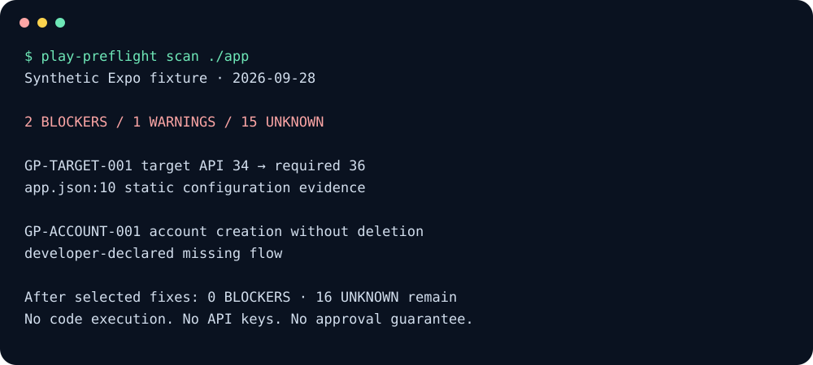

# play-preflight

**Catch Google Play release risks before you upload.**

[](https://github.com/masddffee/google-play-preflight-skills/actions/workflows/ci.yml)
[](LICENSE)
[English](README.md) · [繁體中文](README.zh-TW.md)

A runnable, local-first CLI and GitHub Action for Android, Expo, React Native and Flutter. Inspect build settings and manifests, attach file-level evidence, apply dated policy rules, and separate confirmed risks from questions only a human can answer.



**No API key. No project code execution. No network during scans. No approval guarantee.**

## Try it

Requires Node.js 22+ and Git. Install directly from this repository's v1 branch:

```sh
npx --yes --package="github:masddffee/google-play-preflight-skills#v1" play-preflight scan .
```

Or clone and run without installing dependencies:

```sh
git clone https://github.com/masddffee/google-play-preflight-skills.git
cd google-play-preflight-skills
node bin/play-preflight.js scan fixtures/expo-risk --as-of 2026-09-28
```

The synthetic risk fixture intentionally exits **1** with two blockers. This is a successful detection, not an installation failure. The package is distributed through GitHub; do not use an unverified bare `npx play-preflight` registry package. Pin a reviewed commit instead of the moving `v1` branch for reproducible production installs.

## What you get

| Surface | Included in v1 |
|---|---|
| CLI | Local scan, configuration initialization, explicit policy-source check, predictable exit codes |
| Evidence | Static configuration, caller-supplied merged manifest, or explicitly labeled developer attestation |
| Policy | Dated target-API tables by device and submission type; Billing Library timeline; source links and review expiry |
| Reports | Terminal, JSON, Markdown, standalone HTML and SARIF 2.1.0 |
| CI | Reusable Node 24 Action, annotations, step summary, report paths and check counts |
| Agent integration | Skill that invokes the CLI and keeps manual review separate |

There are **20 check categories**, not 20 fully automated policy certifications. Some are deterministic configuration checks; some require artifacts or developer attestations; others deliberately remain UNKNOWN. [Read the rule catalog and limits](docs/rules.md).

## Scan → inspect → fix → rescan

```sh
# Save JSON, Markdown, HTML and SARIF in one directory
play-preflight scan ./mobile --output-dir .play-preflight

# Use the merged release manifest from your own trusted build
play-preflight scan ./mobile --manifest android/app/build/intermediates/merged_manifests/release/processReleaseManifest/AndroidManifest.xml

# Fail a release gate on blockers, warnings OR unknowns
play-preflight scan ./mobile --fail-on unknown

# Machine-readable output; stdout is JSON only
play-preflight scan ./mobile --format json
```

Manifest output paths vary by Android Gradle Plugin and build variant. Pass the actual path from your build, not a guessed path. Source scans do **not** build the app or resolve arbitrary Gradle/Expo code.

### Read the status correctly

| Status | Meaning |
|---|---|
| BLOCKER | A concrete violated check or an explicitly declared missing requirement; not a prediction of Google's verdict |
| WARNING | A likely configuration risk or maintenance issue; investigate |
| UNKNOWN | Required context, resolved artifacts or manual verification is missing |
| PASS | Only the stated check is satisfied by the evidence shown; attestations remain unverified |
| SKIP | Not applicable under the supplied context |

Default exit behavior fails on BLOCKER only. `--fail-on warning` also fails on warnings; `--fail-on unknown` also fails on unknowns; `--fail-on none` always returns 0 **for a completed scan**, never for invalid inputs. Exit **2** means an operational/configuration error.

## GitHub Action

```yaml
name: Google Play preflight
on: [pull_request, workflow_dispatch]
permissions:
  contents: read
jobs:
  preflight:
    runs-on: ubuntu-latest
    steps:
      - uses: actions/checkout@3d3c42e5aac5ba805825da76410c181273ba90b1 # v7.0.1
        with:
          persist-credentials: false
      - uses: masddffee/google-play-preflight-skills@v1
        id: preflight
        with:
          path: .
          fail-on: blocker
      - uses: actions/upload-artifact@043fb46d1a93c77aae656e7c1c64a875d1fc6a0a # v7.0.1
        if: always()
        with:
          name: play-preflight-report
          path: .play-preflight/
          include-hidden-files: true
```

Pin this Action to a reviewed full commit SHA for production. It needs no API token. Reports are written before the failure threshold is applied, so failures still produce artifacts. [Inputs, outputs, monorepos and SARIF](docs/github-action.md).

## Tell it what source code cannot prove

```sh
play-preflight init .
```

`.play-preflight.json` contains non-secret context. Omit unknown values instead of inventing `true` declarations:

```json
{
  "device": "mobile",
  "submission": "new",
  "accountCreation": true,
  "accountDeletionInApp": false,
  "digitalGoods": true,
  "markets": ["US", "TW"]
}
```

The example deliberately declares a missing account-deletion flow and therefore blocks. Do not put passwords, test credentials, API keys or signing material here. [Full configuration reference](docs/configuration.md).

## Use with coding agents

```sh
npx skills add masddffee/google-play-preflight-skills --skill google-play-review-preflight
```

The skill calls the CLI, reads its evidence, proposes minimal changes and rescans. It never silently changes UNKNOWN to PASS. For manual installation, copy the complete `skills/google-play-review-preflight` directory into your agent's skill directory. The skill's operational instructions are self-contained; the CLI is installed separately from this repository.

## Policy maintenance and limitations

Snapshot: **2026-09-28**. Scheduled source checks look for reachability and selected policy phrases; they do **not** automatically approve policy changes. A snapshot past its review date cannot yield a target-API PASS.

```sh
play-preflight policy check
play-preflight policy check --online --format json
```

No Play Console API integration, runtime testing, AAB/ELF inspection, full Gradle interpreter, automatic fixes, or approval prediction is included. A Billing SDK does not prove compliant payments, and Stripe is not automatically a blocker. Arbitrary Expo config, flavor overrides and unresolved dependencies require trusted build evidence. [Security model](SECURITY.md) · [Policy sources](rules/policy.json).

## Reproduce the evidence

```sh
npm run check
npm test
npm run smoke
npm run demo
```

Fixtures are synthetic, not real-world accuracy benchmarks. No false-positive rate, rejection-prevention rate, user count or third-party endorsement is claimed. [Testing and release notes](docs/validation.md) · [Contributing](CONTRIBUTING.md) · [Launch kit](docs/launch-kit.md).

MIT licensed. Not affiliated with or endorsed by Google. This repository retains its original URL; `play-preflight` is the executable product name.
